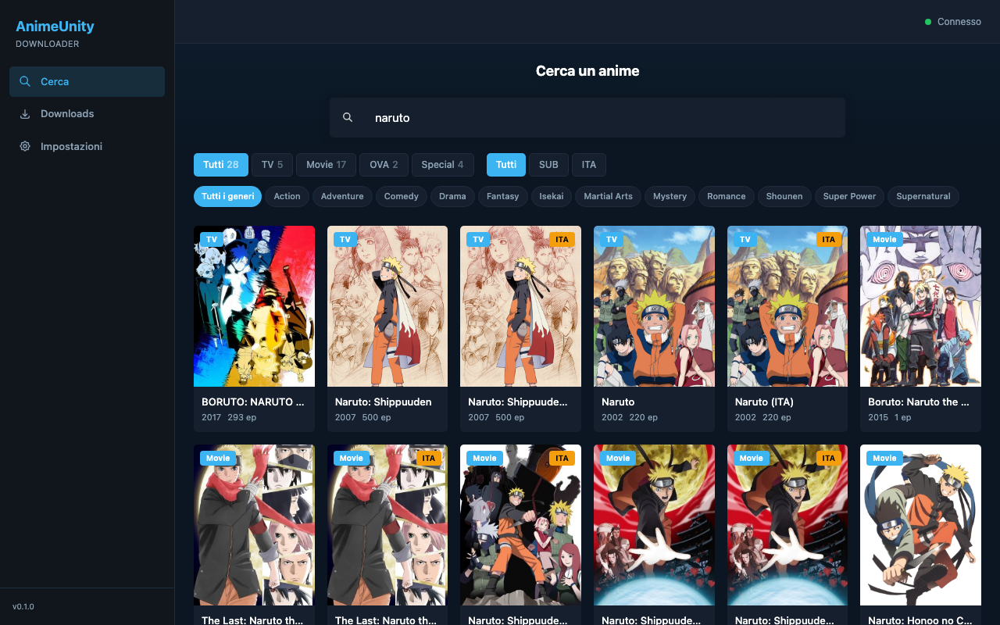

<p align="center">
  
</p>

<h1 align="center">AnimeUnity Downloader</h1>

<p align="center">
  <strong>Self-hosted web app to search, download and organize anime from AnimeUnity — with automatic metadata embedding.</strong>
</p>

<p align="center">
  
  
  
  
  
</p>

<br />

<!--
  SCREENSHOT: Replace this comment with a screenshot of the app.
  Example:
  <p align="center">
    
  </p>
-->

---

## Table of Contents

- [Features](#features)
- [Quick Start](#quick-start)
- [Configuration](#configuration)
- [Architecture](#architecture)
- [Tech Stack](#tech-stack)
- [API Reference](#api-reference)
- [Development](#development)
- [Project Structure](#project-structure)
- [Disclaimer](#disclaimer)

---

## Features

- **Search** — Search the entire AnimeUnity catalog directly from the web UI with instant results, type/genre/dub filters
- **Currently Airing** — Homepage shows anime currently airing ("In onda ora") so you can discover new episodes immediately
- **Batch Download** — Download single episodes, custom ranges, or entire series with one click
- **Real-time Progress** — Live download progress, speed, and status updates via WebSocket
- **Metadata Embedding** — Automatically embeds cover art, title, episode number, genres, plot, and year into every MP4 file using ffmpeg
- **HLS Support** — Handles both direct MP4 and M3U8/HLS streams, automatically selecting the best quality
- **Resume Support** — Interrupted downloads resume from where they left off (Range header support)
- **Queue Management** — Configurable concurrent downloads (1-5), cancel, retry, clear completed
- **Organized Library** — Files saved as `Anime Title/EP001.mp4` with smart zero-padding
- **Disk Monitoring** — Real-time disk usage display with low-space warnings
- **Cloudflare Bypass** — TLS fingerprint impersonation via curl-cffi for reliable access
- **Persistent Storage** — SQLite database tracks all downloads across container restarts
- **Docker-first** — Single container, multi-stage build, health check included
- **Dark UI** — Clean, modern dark interface inspired by AniList

---

## Quick Start

**Docker Compose** (recommended):

```yaml
# docker-compose.yml
services:
  animeunity:
    image: ghcr.io/hasasiero/animeunity-downloader:latest
    container_name: animeunity-downloader
    ports:
      - "8080:8000"
    volumes:
      - animeunity-data:/data
      - ~/Downloads/Anime:/downloads
    environment:
      - MAX_CONCURRENT_DOWNLOADS=2
    restart: unless-stopped

volumes:
  animeunity-data:
```

```bash
docker compose up -d
```

Open **http://localhost:8080** and start searching.

---

**Docker CLI**:

```bash
docker run -d \
  --name animeunity-downloader \
  -p 8080:8000 \
  -v animeunity-data:/data \
  -v ~/Downloads/Anime:/downloads \
  -e MAX_CONCURRENT_DOWNLOADS=2 \
  --restart unless-stopped \
  ghcr.io/hasasiero/animeunity-downloader:latest
```

---

**Build from source**:

```bash
git clone https://github.com/hasasiero/AnimeUnityDownloaderHasasiero.git
cd AnimeUnityDownloaderHasasiero
docker compose up -d --build
```

---

## Configuration

All configuration is done via environment variables:

| Variable | Description | Default | Required |
|---|---|---|---|
| `DOWNLOAD_PATH` | Host path where anime files are saved | `~/Downloads/AnimeUnity` | No |
| `MAX_CONCURRENT_DOWNLOADS` | Parallel downloads (1-5) | `2` | No |
| `LOG_LEVEL` | Logging verbosity (`DEBUG`, `INFO`, `WARNING`, `ERROR`) | `INFO` | No |
| `PORT` | Host port to expose the web UI | `8080` | No |

### Volumes

| Container Path | Purpose |
|---|---|
| `/data` | SQLite database (persistent across updates) |
| `/downloads` | Downloaded anime files |

### Health Check

The container includes a built-in health check at `/api/health` that runs every 30 seconds.

---

## Architecture

```
┌─────────────────────────────────────────────────────────────┐
│                        Browser                              │
│   React 19 + TanStack Query + Zustand + Tailwind CSS        │
└─────────────┬──────────────────────┬────────────────────────┘
              │ REST API             │ WebSocket
              ▼                      ▼
┌─────────────────────────────────────────────────────────────┐
│                     FastAPI (Uvicorn)                        │
│                                                             │
│  ┌──────────┐  ┌────────────┐  ┌──────────┐  ┌──────────┐  │
│  │  Search   │  │   Anime    │  │ Download │  │ Settings │  │
│  │  Service  │  │  Service   │  │  Service │  │ Service  │  │
│  └────┬─────┘  └─────┬──────┘  └────┬─────┘  └────┬─────┘  │
│       │              │              │              │         │
│       ▼              ▼              ▼              ▼         │
│  ┌─────────────────────────┐  ┌──────────────────────────┐  │
│  │   AnimeUnity Client     │  │     SQLite (aiosqlite)   │  │
│  │  (curl-cffi + TLS imp.) │  │     via SQLAlchemy ORM   │  │
│  └─────────────────────────┘  └──────────────────────────┘  │
│                                                             │
│  ┌─────────────────────────┐  ┌──────────────────────────┐  │
│  │   Extractor Service     │  │    Metadata Service      │  │
│  │  (resolve video URLs)   │  │  (ffmpeg embed cover +   │  │
│  └─────────────────────────┘  │   tags into MP4)         │  │
│                               └──────────────────────────┘  │
│  ┌─────────────────────────┐                                │
│  │   Download Worker       │                                │
│  │  (MP4 stream / M3U8     │                                │
│  │   remux + progress)     │                                │
│  └─────────────────────────┘                                │
└─────────────────────────────────────────────────────────────┘
```

### Download Flow

1. **Search** — User searches from the web UI, backend queries AnimeUnity's API
2. **Select** — User picks episodes (single, range, or all)
3. **Queue** — Backend creates DB records and enqueues to the download worker
4. **Resolve** — Video URL extracted just-in-time from the embed page (MP4 or M3U8)
5. **Download** — Stream downloaded with progress tracking (resume-capable for MP4)
6. **Metadata** — ffmpeg embeds cover art, title, episode info, genres into the MP4 container
7. **Notify** — WebSocket broadcasts real-time progress and status changes to all connected clients

---

## Tech Stack

### Backend

| Component | Technology |
|---|---|
| Framework | [FastAPI](https://fastapi.tiangolo.com/) + [Uvicorn](https://www.uvicorn.org/) |
| ORM | [SQLAlchemy 2.0](https://www.sqlalchemy.org/) (async) + [aiosqlite](https://github.com/omnilib/aiosqlite) |
| HTTP Client | [curl-cffi](https://github.com/lexiforest/curl-cffi) (TLS fingerprint impersonation) |
| HTML Parsing | [BeautifulSoup4](https://www.crummy.com/software/BeautifulSoup/) |
| HLS | [m3u8](https://github.com/globocom/m3u8) + ffmpeg |
| Validation | [Pydantic v2](https://docs.pydantic.dev/) |
| Runtime | Python 3.12 |

### Frontend

| Component | Technology |
|---|---|
| Framework | [React 19](https://react.dev/) + TypeScript 5.9 |
| Build Tool | [Vite 8](https://vite.dev/) |
| Styling | [Tailwind CSS 4](https://tailwindcss.com/) |
| State | [Zustand 5](https://zustand.docs.pmnd.rs/) (WebSocket state) |
| Data Fetching | [TanStack Query 5](https://tanstack.com/query) |
| Routing | [React Router 7](https://reactrouter.com/) |

### Infrastructure

| Component | Technology |
|---|---|
| Container | Docker (multi-stage build) |
| Database | SQLite (WAL mode) |
| Media Processing | ffmpeg |
| Orchestration | Docker Compose |

---

## API Reference

The backend exposes a REST API at `/api`. All endpoints return JSON.

### Search

| Method | Endpoint | Description |
|---|---|---|
| `GET` | `/api/search?title=...` | Search anime by title |
| `GET` | `/api/latest` | Get currently airing anime |

### Anime

| Method | Endpoint | Description |
|---|---|---|
| `GET` | `/api/anime/{id}-{slug}` | Get anime details |
| `GET` | `/api/anime/{id}-{slug}/episodes?start=1&end=24` | Get episodes (paginated) |

### Downloads

| Method | Endpoint | Description |
|---|---|---|
| `POST` | `/api/downloads` | Enqueue episodes for download |
| `GET` | `/api/downloads?status=downloading,queued` | List downloads (filterable by status) |
| `DELETE` | `/api/downloads/{id}` | Cancel/delete a download |
| `POST` | `/api/downloads/{id}/retry` | Retry a failed download |
| `GET` | `/api/downloads/{id}/file` | Download the completed MP4 file |
| `POST` | `/api/downloads/cancel-all` | Cancel all active downloads |
| `POST` | `/api/downloads/clear-completed` | Remove completed downloads from the list |
| `GET` | `/api/disk-usage` | Get disk usage statistics |

### Settings

| Method | Endpoint | Description |
|---|---|---|
| `GET` | `/api/settings` | Get current settings |
| `PUT` | `/api/settings` | Update settings |
| `GET` | `/api/settings/browse?path=/` | Browse filesystem (for directory picker) |

### WebSocket

| Endpoint | Description |
|---|---|
| `ws://host/api/ws/downloads` | Real-time download progress and status updates |

**WebSocket message types:**

```json
// Progress update
{ "type": "progress", "download_id": 1, "progress": 45.2, "downloaded_bytes": 150000000, "total_bytes": 332000000, "speed_bps": 5242880 }

// Status change
{ "type": "status", "download_id": 1, "status": "completed", "file_path": "/downloads/Anime/EP01.mp4" }

// Error
{ "type": "error", "download_id": 1, "message": "Connection timeout" }
```

### Health

| Method | Endpoint | Description |
|---|---|---|
| `GET` | `/api/health` | Health check (`{"status": "ok"}`) |

---

## Development

### Prerequisites

- Python 3.12+
- Node.js 20+
- ffmpeg

### Backend

```bash
cd backend
python -m venv .venv
source .venv/bin/activate
pip install -r requirements.txt

# Run the API server
uvicorn backend.app.main:app --reload --port 8000
```

### Frontend

```bash
cd frontend
npm install
npm run dev    # Starts on http://localhost:5173 with proxy to :8000
```

### Build Docker image locally

```bash
docker compose up -d --build
```

---

## Project Structure

```
.
├── docker-compose.yml          # Docker orchestration
├── Dockerfile                  # Multi-stage build (Node + Python)
├── .env.example                # Environment variables template
├── pyproject.toml              # Python project metadata & dependencies
│
├── backend/
│   └── app/
│       ├── main.py             # FastAPI entry point + lifespan
│       ├── config.py           # Pydantic settings from env vars
│       ├── database.py         # SQLAlchemy async engine + session
│       ├── api/
│       │   ├── router.py       # Route aggregation
│       │   ├── search.py       # GET /api/search
│       │   ├── anime.py        # GET /api/anime/{id}-{slug}
│       │   ├── downloads.py    # Download CRUD + file serving
│       │   ├── settings.py     # Settings + filesystem browse
│       │   ├── ws.py           # WebSocket /api/ws/downloads
│       │   └── deps.py         # Dependency injection helpers
│       ├── models/
│       │   ├── download.py     # Download ORM model
│       │   └── setting.py      # Key-value settings model
│       ├── schemas/
│       │   ├── anime.py        # Search/detail Pydantic schemas
│       │   ├── download.py     # Download request/response schemas
│       │   └── setting.py      # Settings schemas
│       ├── services/
│       │   ├── animeunity_client.py  # HTTP client (TLS impersonation)
│       │   ├── search_service.py     # Search AnimeUnity catalog
│       │   ├── anime_service.py      # Fetch anime info + episodes
│       │   ├── extractor_service.py  # Resolve video URLs (JIT)
│       │   ├── download_worker.py    # MP4/M3U8 download + progress
│       │   ├── download_service.py   # Queue management + orchestration
│       │   ├── metadata_service.py   # ffmpeg metadata embedding
│       │   ├── settings_service.py   # Persistent settings
│       │   └── ws_manager.py         # WebSocket broadcast manager
│       └── utils/
│           ├── filename.py     # Filename sanitization + generation
│           └── retry.py        # Async retry decorator
│
└── frontend/
    ├── package.json
    ├── vite.config.ts
    ├── tsconfig.json
    └── src/
        ├── main.tsx            # React entry point
        ├── App.tsx             # Router + providers
        ├── index.css           # Tailwind theme (dark, AniList-inspired)
        ├── api/                # Typed API client functions
        ├── types/              # TypeScript type definitions
        ├── hooks/              # useWebSocket custom hook
        ├── stores/             # Zustand download state
        ├── pages/              # SearchPage, AnimeDetailPage, DownloadsPage, SettingsPage
        └── components/         # UI components (AnimeCard, EpisodeRow, DownloadItem, etc.)
```

---

## Disclaimer

This project is intended for **personal use only**. It is not affiliated with, endorsed by, or connected to AnimeUnity in any way. The authors do not host, distribute, or provide any copyrighted content. Users are solely responsible for ensuring their use of this software complies with applicable laws in their jurisdiction.

Use at your own risk.
